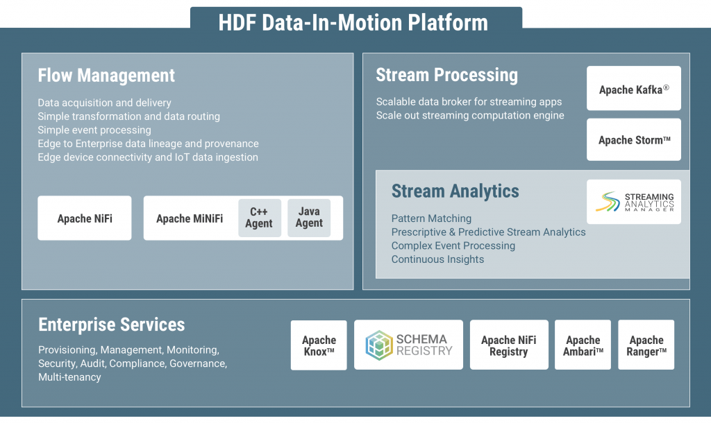
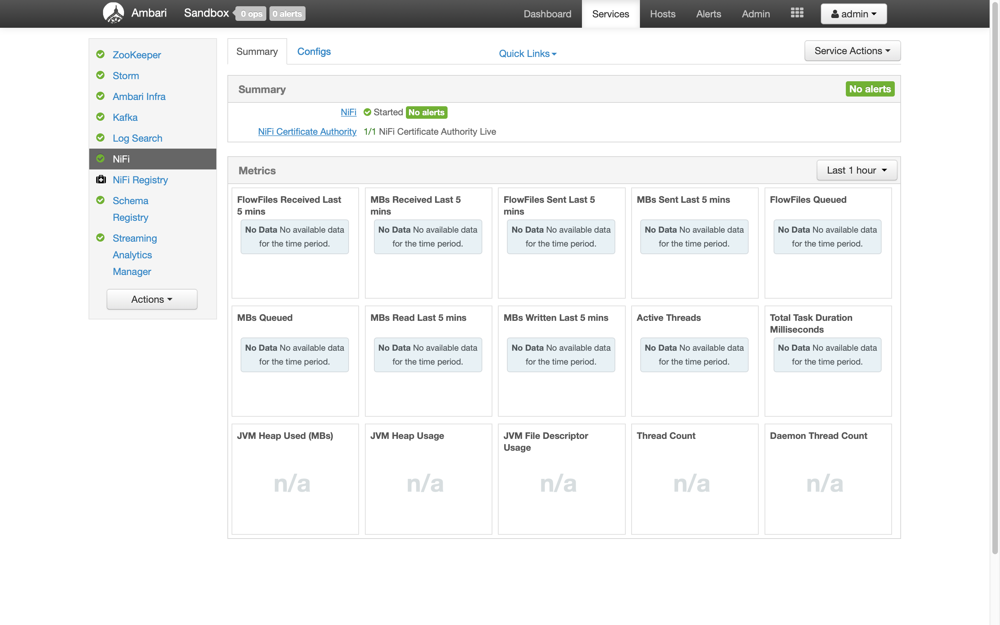
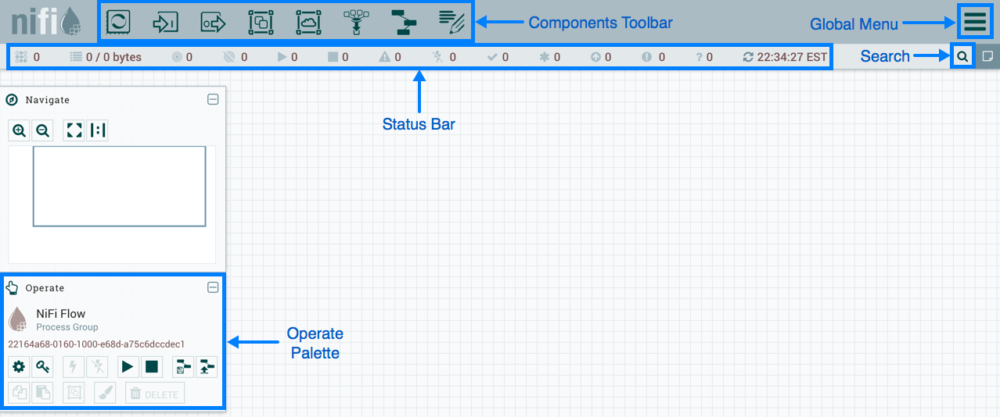
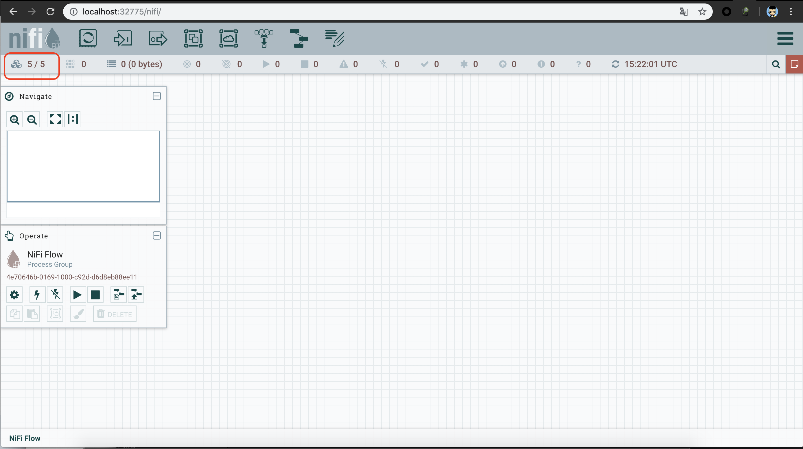

# Nifi 

## NiFi简介
Apache NiFi项目，它是一种实时数据流处理 系统，在去年由美国安全局(NSA)开源并进入Apache社区，NiFi初始的项目名称是Niagarafiles。当NiFi项目开源之后，一些早先在NSA的开发者们创立了初创公司Onyara，Onyara随之继续NiFi项目的开发并提供相关的支持。Hortonworks公司收购了Onyara并将其开发者整合到自己的团队中,形成HDF(Hortonworks Data Flow)平台。 
 
**NiFi在Hortonworks的定位**   
因为NiFi可以对来自多种数据源的流数据进行处理，Hortonworks认为HDF平台非常适合用于物联网 (IoAT)的数据处理。HDF中的数据流动可以是多个方向，甚至是点对点的，用户可以同收集到的数据流进行交互，这种交互甚至可以延伸到数据源，比如一些传感器或是设备。
HDF provides an interactive data flow management platform powered by Apache NiFi/MiniFi for easy ingestion, routing,management, and delivery of any data anywhere (edge, cloud, data center) to any downstream system.
Sandbox 运行


### Features
- Web-based user interface
    -  Seamless experience between design, control, feedback, and monitoring  
- Highly configurable  
    - Loss tolerant vs guaranteed delivery  
    - Low latency vs high throughput
    - Dynamic prioritization
    - Flow can be modified at runtime
    - Back pressure
- Data Provenance
    - Track dataflow from beginning to end
- Designed for extension
    - Build your own processors and more
    - Enables rapid development and effective testing
- Secure
    - SSL, SSH, HTTPS, encrypted content, etc...
    - Multi-tenant authorization and internal authorization/policy management
- Extensible Architecture
    - Extension
	- Classloader Isolation
	- Site-to-Site Communication Protocol
- Flexible Scaling Model  
    - Scale-out (Clustering)  
	hundreds of MB per second /  GB per second
	- Scale-up & down


## 界面

在Web 界面 通过拖放组件，配置数据流。
支持 分组 聚合 
Templates (复用 复杂 dataflow)

## 架构

#### NiFi is a Java based system that executes within a JVM.
#### Primary components are:
- Web Server
    - Hosts NiFi’s HTTP-based control API
- Flow Controller
    - Provides and schedules threads for execution
- Extensions
    - FlowFile Processors, Controller Services, etc.
- Repositories
    - FlowFile  
	FlowFile is comprised of two major pieces: content and attributes.
    - Content  
	数据流的实际内容
    - Provenance  
	the history of each FlowFile, Each time that an event occurs for a FlowFile (FlowFile is created, forked, cloned, modified, etc.) a new provenance event is created.
### Cluster
Zero-Master （depend on ZooKeeper）

Cluster 下的 Web UI



## Components
- Processors 
    - DataTransformation: 压缩和解缩;content的字符集编码转换;加密解密;文本替换;XSLT转化到XML，JOLT到JSON
    - Routing& Mediation: 数据流限速;检测重复数据;分布式负载;检测组件活跃性;基于属性的路由;属性扫描;基于内容路由;内容扫描;验证XML
    - DatabaseAccess：JSON转SQL;执行SQL;PutSQL; 执行HiveSQL的select将结果写入avro或者csv的FlowFile;putHiveQL
    - 属性抽取：JSONPath表达式（类似xpath）;XPath; XQuery; 抽取文本;Hash属性;HashContent; 识别mime类型;更新属性
    - 系统交互：执行process;执行流命令
    - 数据获取：获取File;获取FTT，获取SFTP;获取JMS队列;获取JMStopic；获取HTTP;监听HTTP；监听UDP;获取HDFS;listHDFS/fetchHDFS; 获取S3;获取Kafka;获取Mongo;获取Twitter
    - 数据Egress/发送数据：发送email;发送FIle;PutFtp;发送FTP、SFTP、JMS、SQL、Kafka、Mongo
    - 拆分和聚合：拆分文本、json、xml、解压content、mergeContent、segmentContent、SplitContent
    - HTTP:get,listen, invoke, post, 处理httpresponse和request
    - AmazonWeb Services: fetch s3, put s3, put sns, get sns, put sqs, deletesqls， 
	- Azure ...	
- Controller Services 
    - avro csv  xml(reader writer) jpath
    - Pool (DBCP Hive ...)
    - Script
- Reporting Tasks
    - Ambari （HDP）,Ganglia
    - Metrics，DiskUsage Memory 
## WorkingWith Attributes
- 常用属性：filename,path, uuid, filesize...
- 用户定义属性：可以给FlowFile添加用户自定义属性。
- 根据属性进行路由
- 表达式语言/使用属性值：NIFI提供了expressionlanguage对属性进行灵活的操作，以便想FlowFile走到不同的processor。

## 监控NIFI
数据流过NIFI，你需要知道NIFI是否正常，流量是否合理，负载是否均衡。因此需要监控。
- 状态条statusbar: 在NIFI面板上面。
- 组件统计：每个组件都提供自己的统计信息，以便监控。统计五分钟数据，统计历史数据
- Bulletins：用户可以通过分析log关注某些事件发生，如果出现了，以bulletinindicator的方式展现，在屏幕右上角
- 数据源dataprovenance：NIFI对处理的每一片数据都保持各种详细的处理记录。数据从前到后的各种操作都存放在NIFI的provenancerepository。在全局菜单选择dataprovenance，能看到这些记录可以对这些记录和事件进行检索处理。也可以以跟踪的方式，沿着processor的时间线进行详细分析。
- LineageGraph: 这个图可以显示一片数据从进入系统到执行各种操作已经产生的子数据的各种结果，类似一个famlilytree。
- **使用 Reporting Tasks 接口开发自定义的监控**

## 数据处理 
### Expression Language Guide
FlowFile attributes ：FlowFile metadata ("filename" "uuid" "path" "absolute.path" ...)
For example, ${filename} will return the value of the filename attribute.
EL Type, Type coercion, Function, Boolean Logic, String Manipulation , jsonPath , Plus divde ...,Format
```
${filename:substringAfter('.')}
${filename:indexOf('.')}
$.*
```
### RecordPath （DSL）
Type (Map Array ...) Operator  Function (substring replace concat format encode decode contains starsWith endsWith isEmpty isBlank)
```
{
	"name": "John Doe",
	"workAddress": {
		"number": "123",
		"street": "5th Avenue",
		"city": "New York",
		"state": "NY",
		"zip": "10020"
	},
	"homeAddress": {
		"number": "456",
		"street": "116th Avenue",
		"city": "New York",
		"state": "NY",
		"zip": "11697"
	}
}
```
例子 ：
```
/details/address/zip
/details/address['city', 'state', 'zip']
//addresses[0..-1]
/[./state != 'NY']/zip
/*/city[../state = 'NJ']
/name[ contains('John') ]
substring( /name, 0, 1005)
replace( /name, 'o', 'x' )
replace( /name, 'Doe', /workAddress/city )
replaceRegex( /name, '\s+.*', /workAddress/city )
toBytes( /s, "UTF-16")
format( /eventDate, "yyyy-MM-dd’T’HH:mm:ss’Z'")    //2017-10-20’T'11:00:00’Z'
base64Encode(/name)
```

## Demo
### 1. tcp
**流程**
1. 监听一个 tcp 端口
2. 收到的消息 落盘


**用到的功能**
1. listen tcp
2. 操作 属性
3. Express Language
4. save to file
### 2. sql -> json

### 3.  csv -> json
**流程**
1. 读取csv文件
2. 指定filename
3. 保存为json


**用到的功能**
1. 监视目录，读取文件
2. 操作 属性 
3. 注册 avro schema
4. 设置 csv reader
5. 设置 Json Writer
6. save to file

## Tool
+ Admin Tool
    - cli
    + ssl
- 版本管理
- 其他


## 性能调优 Best practices for setting up a high performance NiFi 
### Bootstrap.conf 
- JVM 内存设置
```
java.arg.2=-Xms4g
java.arg.3=-Xmx8g
```
- G1内存回收
```
java.arg.13=-XX:+UseG1GC
```
### CPU 
通过限制空闲进程占用CPU的时间来达到控制CPU占用的目的。默认值10 毫秒，很大程度上降低了CPU利用率。调低参数会降低系统延迟提高性能，但会增大CPU占用率，需要根据具体性能需求来设置。
```
nifi.bored.yield.duration=10 millis
```
调整浏览器界面的反应速度
```
nifi.ui.autorefresh.interval=30 sec
```
### H2 db
NiFi有两种H2数据库，user DB记录用户登录信息，History DB记录编辑历史 ，移到安装路径以外，防止覆盖
### FlowFile
- 记录数据流的状态信息，避免空间不足导致丢失；路径设置为NiFi安装路径以外，尽量不要与高I/O的程序、content repository 或者 provenance repository在相同的磁盘上。 
```
nifi.flowfile.repository.directory=./flowfile_repository
```
-  避免FlowFile过度地占用JVM内存，因此，需要限制驻留内存的FlowFile数量。
```
nifi.queue.swap.threshold=20000
```
如果想提高性能 可以增大这个数值 但是消耗 heap ，根据实际情况权衡
### Content 
数据流的实际内容保存在Content中，通常应该独占高性能高容量的磁盘
```
nifi.content.repository.directory.default=./content_repository
```  
若单一RAID仍不能满足需求，可以为一个NiFi实例设置多个Content repository。NiFi将以轮询调度方式存储文件。将nifi.content.repository.directory.default删除或注释，然后为每个Content Repository增加一行参数指定路径，如下例子。
```
nifi.content.repository.directory.contS1R1=/cont-repo1/content_repository
nifi.content.repository.directory.contS1R2=/cont-repo2/content_repository
nifi.content.repository.directory.contS1R3=/cont-repo3/content_repository
```
注意，contS1R1, contS1R2, contS1R3，只是人为起的名字，可以自由命名。
###  Provenance 与 content 类似
```
nifi.provenance.repository.directory.provS1R1=/prov-repo1/provenance_repository
nifi.provenance.repository.directory.provS1R2=/prov-repo2/provenance_repository
```
命名规则也与Content repository相同。
Provenance Repository 允许多用户同时查询。当访问用户很多时，可以修改执行查询任务的线程数量以提高性能。
```
nifi.provenance.repository.query.threads=2
```
同样我们也可以修改执行Provenance Repository索引任务的线程数量
```
nifi.provenance.repository.index.threads=1
```
当遇到“The rate of the dataflow is exceeding the provenance recording rate. Slowing down flow to accommodate.”提示时，说明flowfile数量过多， Provenance处理速度不足，限制性能。需要增加索引线程的数量加以应对。不过，需要说明的是，此非多多益善，总的资源有限，增加了索引线程数，势必会争夺其他任务的资源。建议在无前文所示的提示出现时使用默认值。
```
nifi.provenance.repository.index.shard.size=500 MB  
```
该参数影响Provenance查询时占用多少堆空间。提高该参数会增加查询性能，但是会增加堆消耗。默认值为500MB（注：此参数“影响”堆占用，并不代表会占用500MB的堆）
设置从“PersistentProvenanceRepository”改为“VolatileProvenanceRepository”，从而让Provenance Repository保存在堆中而非硬盘上，每次JVM重启就会丢失，但是可以提高性能。
通过
```
nifi.provenance.repository.buffer.size=100000
```
限制provenance能用多少heap  

